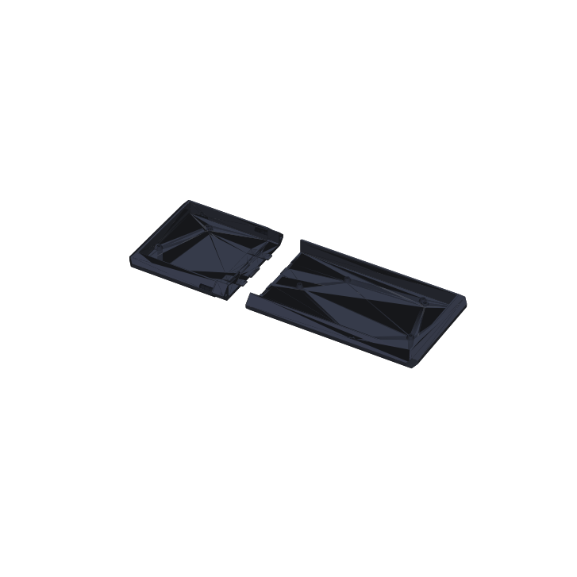

# Case — Melody96 (3D Printable)



*Rendered from `Main Body/` — left + right printed halves.*

3D-printable case for the SKYWAY 96 PCB. The board shares the **Melody96 / YMDK96** footprint, so any Melody96-compatible case fits.

Design by **HughMann** — [Thingiverse thing #3883](https://www.thingiverse.com/thing:3883). Files mirrored here for convenience; original license terms apply.

## Print Layout

The case prints in two halves (**Body L** + **Body R**) joined by a center **Stripe** accent piece. Add **Risers** for tilt and **Hardware** for assembly.

```
[ Body L ] [ Stripe ] [ Body R ]
              + Risers (tilt)
              + Feet / Dowels / Standoffs
```

## Parts

### `Main Body/`
| File | Notes |
|---|---|
| `Body L.stl` / `Body R.stl` | Left + right case halves (standard wall) |
| `Body L 2mm.stl` / `Body R 2mm.stl` | Thicker 2 mm wall variant — stiffer, more filament |
| `Stripe.stl` | Center accent strip that joins the two halves |
| `3 Part Stripe.stl` | Stripe split into 3 pieces — for smaller print beds |

> Print **either** the standard halves **or** the 2 mm halves — not both.

### `Risers/`
Add a 5° typing tilt.
| File | Notes |
|---|---|
| `5 Degree Riser Single Piece.stl` | One-piece riser (needs a large bed) |
| `5 Degree Riser L.stl` / `5 Degree Riser R.stl` | Split riser for smaller beds |

### `Hardware/`
| File | Notes |
|---|---|
| `Feet.stl` | Bottom feet |
| `Dowel.stl` | Alignment pins joining the case halves |
| `Extra standoff.stl` | Spare PCB mounting standoff |

### `Remixes/`
Community variants — alternate styling, same fit.
| File | Notes |
|---|---|
| `Granular Theory (Stoic Reluctance) Body L M2.stl` | Remix left half (M2 hardware) |
| `Granular Theory (Stoic Reluctance) Body R M2.stl` | Remix right half (M2 hardware) |
| `Granular Theory (Stoic Reluctance) Stripe M2.stl` | Remix center stripe |
| `Hope Lost (Sincerity or Rejection) One-Piece File.stl` | One-piece remix body |

## Print Tips

- **Material:** PLA or PETG.
- **Orientation:** print bodies flat (open side up) for clean key cutouts.
- **Bed size:** if a single-piece part won't fit, use the split equivalent (`3 Part Stripe`, split risers).
- **Mounting:** dowels align the halves; standoffs hold the PCB.
