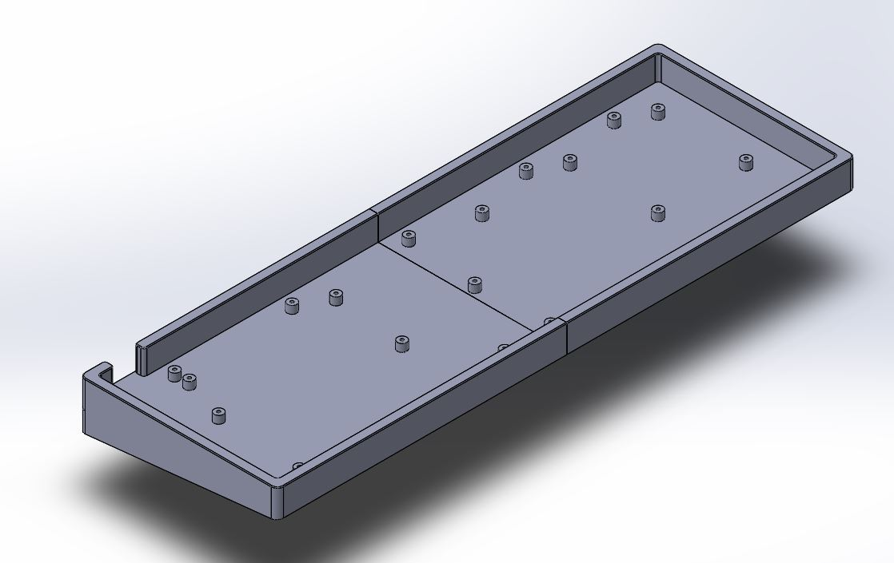
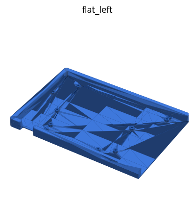
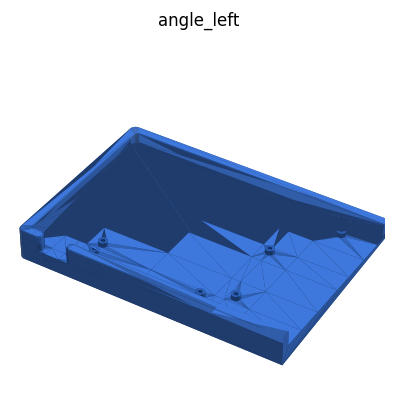
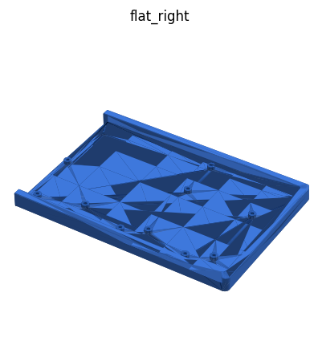
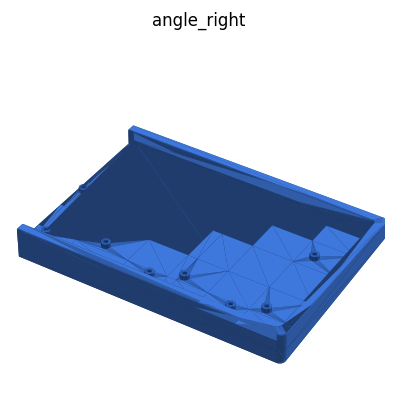
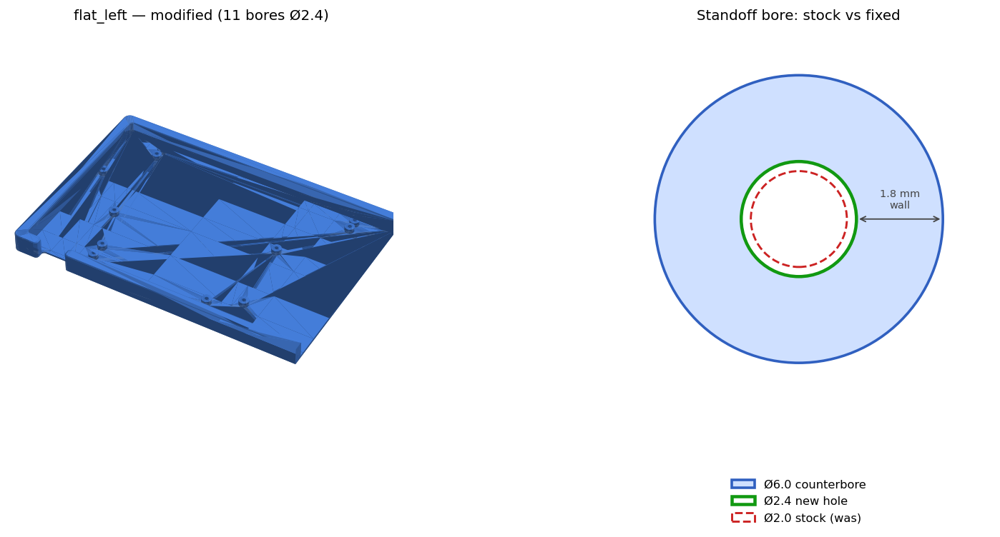

# RobotDoctor 96% Case (Thingiverse 4401525)

3D-printable case for a **96% mechanical keyboard** (Melody96 / YMDK96-class PCB),
an alternate to the [Melody96 (HughMann) case](../Melody96%20Case%20%28HughMann%29/).

Source design: **"Mechanical Keyboard Case for 96% Keyboard"** by
[RobotDoctor on Thingiverse](https://www.thingiverse.com/thing:4401525)
(thing **4401525**). Licensed **Creative Commons — Attribution (CC-BY)**.
See [`LICENSE.txt`](LICENSE.txt). This repo archives the original files,
adds build notes, and tracks local modifications.

## Render

The case is a tray-style bottom: a perimeter wall with **standoffs** the PCB
screws down onto. Because a 96% board is long, the tray is **split into left +
right halves** so each fits a normal print bed; the seam sits mid-case.

## What's in here

| File | Half | Profile |
|------|------|---------|
| [`plates/96plate_flat_left.STL`](plates/96plate_flat_left.STL)   | left  | flat (0°) |
| [`plates/96plate_flat_right.STL`](plates/96plate_flat_right.STL) | right | flat (0°) |
| [`plates/96plate_angle_left.STL`](plates/96plate_angle_left.STL) | left  | angled (typing tilt) |
| [`plates/96plate_angle_right.STL`](plates/96plate_angle_right.STL)| right | angled (typing tilt) |

Pick **one profile** (flat *or* angle) and print **both halves** of it.

3D renders of the four modified plates (Ø2.4 bores):

| Flat | Angle |
|------|-------|
|    |    |
| `flat_left`  | `angle_left`  |
|  |  |
| `flat_right` | `angle_right` |

PCB used, screw holes marked in red (tape measure for scale):

## Print

1. Choose profile — **flat** (board sits flat) or **angle** (built-in typing tilt).
2. Slice `*_left` and `*_right` of that profile.
   - Material: PLA or PETG.
   - Layer height: 0.2 mm.
   - Walls: ≥ 3 perimeters (the standoffs take screw load).
   - Infill: ≥ 20% (bump standoffs/walls denser if your slicer supports modifiers).
   - Supports: only if your orientation needs them; the tray prints best
     **open-side up** (flat on the bed) — no supports for the flat profile.
3. Print both halves.

## Assemble

1. Dry-fit the two printed halves together at the center seam.
2. Drop the **PCB** into the tray, aligning its mounting holes over the standoffs
   (see the marked photo above — ~14 points).
3. Screw the PCB down into the standoffs (M2 screws).
4. Seat switches/stabs, add plate/keycaps, close it up.

## Screw-hole fix (applied)

*Left: modified `flat_left` (11 bores opened to Ø2.4). Right: standoff bore —
red dashed = Ø2.0 stock, green = Ø2.4 new, both inside the Ø6.0 counterbore;
~1.8 mm wall retained.*

The **stock** standoff holes are **Ø2.0 mm** — zero clearance for an M2 screw
(M2 major dia *is* 2.0 mm), so the screw won't pass and the holes had to be
drilled out by hand.

The STLs in [`plates/`](plates/) are **modified**: each of the 11 PCB-mount
bores per half is opened to **Ø2.4 mm** (M2 normal clearance) — screw passes
freely, head still seats in the Ø6 mm counterbore, ~1.8 mm wall retained. The
Ø6 counterbores and case corner/seam posts are untouched. Print these as-is —
no drilling needed.

- Unmodified Ø2.0 originals: [`original/plates/`](original/plates/).
- Re-cut: 4 plates × 11 bores, boolean difference (trimesh + manifold3d),
  result watertight. To change the diameter, copy back the originals and
  re-run with a different target.

## Credits

- Original design © [RobotDoctor](https://www.thingiverse.com/thing:4401525), CC-BY.
- Modifications and build notes: RivasMario.
