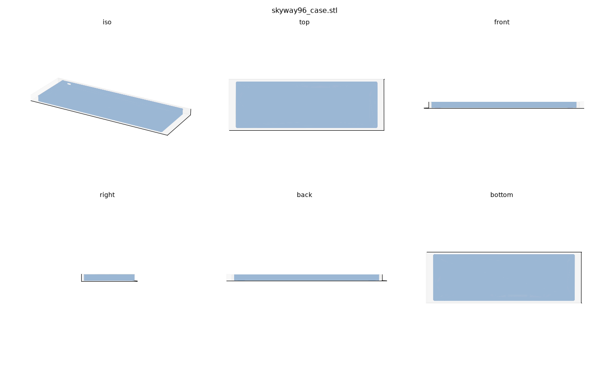

# Case — SKYWAY Custom Tray (parametric, CadQuery)

Original tray case for the SKYWAY 96 PCB, built in **CadQuery** (Python/OpenCASCADE).
Every dimension is driven from *this repo's* gerbers + KiCad PCB — not guessed — so
it fits the real board. Fully parametric: edit the constants in `skyway_case.py`
and re-run.



## What it is

A low-profile **screw-mounted tray**. The PCB drops in from the top and is held
three ways — anti-wobble by design:

1. **Continuous perimeter support ledge** (2.2 mm) under the PCB edge — all-around bearing.
2. **15 M2 standoff posts** — 11 at the PCB's internal mount holes + 4 at the
   edge screw-notches. The PCB screws **down** into them → clamped, not resting → no
   push-down bounce.
3. **Thin clamp lip** (0.8 mm) over the edge — backup hold-down between screws.

Ledge tops and post tops are coplanar at Z = 6.5 mm, so the PCB beds flat and
can't rock. All three features live in the 2.5 mm gap between the PCB edge and the
first switch housing, so nothing fouls switches or keycaps.

Fastening: **M2 heat-set brass inserts** (`screw_mode = "insert"`; 6.5 mm posts,
3.2 mm bore). Set `screw_mode = "selftap"` for screw-into-plastic (5 mm posts,
1.65 mm pilot) if you'd rather skip the inserts.

## Orientation (matches the physical board)

- **USB-C** exits the **far (+Y) wall, right end** — the diagonal corner
  (`USB_FAR_CORNER = True`).
- The **4 edge-notch posts** sit on the **opposite long edge** from the USB hole
  (`FLIP_X = True` mirrors the posts left↔right; the USB stays put).

The PCB only drops in one way (USB aligns to its cutout), so the assembly is
self-orienting — it can't go in backwards.

## Fit data (measured, not guessed)

| Source | Value |
|---|---|
| `Gerber File/...Edge_Cuts.gm1` | PCB outline **361.95 × 114.30 mm** |
| — | = exactly 19 × 6 keys @ 19.05 mm → the PCB *is* the switch grid, **no border** |
| `...kicad_pcb` (J4) | USB-C connector position |
| `...kicad_pcb` MountingHole + Edge.Cuts arcs | 11 M2 mount holes + 4 edge notches |
| 96% / MX standard | 19.05 pitch, 14 × 14 cutout, 2.5 mm edge-to-housing gap |

## Dimensions

| | mm |
|---|---|
| Outer (W × D × H) | **368.8 × 121.1 × 15.1** |
| Cavity (PCB pocket) | 362.8 × 115.1 |
| Wall / floor | 3.0 / 2.5 |
| PCB sits at Z | 6.5 (4.0 mm standoff above floor) |
| Material volume | ≈ 155 cm³ |

## Variants

| Script | Output | Bed |
|---|---|---|
| `model.py` | `skyway96_case.stl` | one-piece — needs **350 mm+** |
| `split.py` | `skyway96_left.stl` (~200 mm) + `skyway96_right.stl` (~175 mm) | **220 mm+** |
| `feet.py`  | `skyway96_foot.stl` — **print ×2** | any |

### Split — drop-in dovetails
Seam is offset to a **key-column gap** (centered-X +9.5 mm) so it misses every
standoff post. The joint is a row of **4 drop-in dovetails** on a raised **seam
rib**: each tenon flares in Y, so once seated the halves can't pull apart in X.
Tenons extrude vertically (constant in Z) → they **print support-free**, and you
**seat the right half straight down** onto the left. (A true *sliding* dovetail
can't work on a left/right split — the case bodies collide before the joint
engages.) The seam rib doubles as an **anti-sag gusset** and stays below the
hotswap sockets so it never touches the PCB.

The dovetails lock and align the **bottom**. The two long **walls just butt** —
**glue the seam faces** (superglue/epoxy) to lock the walls; the dovetails hold
the alignment while it sets. Glue is permanent and stronger than the plastic; for
a removable joint, model a bottom splice plate instead.

### Tilt — 6° dovetail-rail feet
One symmetric foot design (**print ×2**, one per channel). Each has a **male
dovetail rail** on its flat top that **slides along Y into a channel cut in the
case bottom** (added automatically when `FEET_DOVETAIL = True`). The dovetail
captures the foot — it can't drop off — and the wedge tilts the board **USB-edge
up** (front 3 mm → back 15.7 mm), the standard typing angle. Slide a foot into
each channel from the end; friction holds, add glue to make it permanent. Change
`FOOT["tilt_deg"]` in `skyway_case.py` for a different angle.

## Print recipe

- **Material:** PLA or PETG (PETG tougher at this span; print it in an enclosure).
- **Orientation:** body/halves open-side-up, floor flat on the bed. Feet on their
  **6° sloped face** (it's flat → fully supported).
- **Settings:** 0.2 mm layer, 3–4 walls, 15 % gyroid infill.
- **Supports:** none — every overhang is a short bridge (USB top, lip, dovetail
  flares ≤ ~13 mm). Verified by `preflight.py`.
- **Adhesion:** **brim** on the long flat parts — they're warp-prone.
- **First-layer compensation** (~0.15 mm) helps the dovetail fit (elephant's foot
  otherwise fattens the tenons).

## Bill of materials

- 15 × **M2 heat-set inserts** + 15 × M2 screws (PCB → posts)
- 2 × printed tilt feet (optional)
- **Glue / epoxy** for the split seam (if printing the split version)

## Assembly

1. Heat-set the **15 M2 inserts** into the posts.
2. *(split only)* seat the **right half down onto the left** so the dovetails
   drop in, then **glue the seam faces**.
3. Drop the **PCB** into the tray (rests on the ledge + post tops) and drive the
   **M2 screws** down through the PCB holes/notches into the posts.
4. *(optional)* slide a **tilt foot** into each bottom channel.

## Setup / regenerate

```bash
python -m venv .venv
.venv/Scripts/python.exe -m pip install cadquery trimesh numpy matplotlib
.venv/Scripts/python.exe tools/run_model.py model.py --preview   # build + 6-view PNG
.venv/Scripts/python.exe split.py        # split halves
.venv/Scripts/python.exe feet.py         # tilt foot
.venv/Scripts/python.exe preflight.py    # printability check
```

(`.venv` is gitignored — 761 MB, recreate with the commands above.)

## Parameters (in `skyway_case.py` unless noted)

| Param | Effect |
|---|---|
| `wall`, `floor`, `above_pcb` | thickness / stiffness / wall height above PCB |
| `lip_w`, `ledge_w` | clamp / support overhang (shrink if it clips switches) |
| `screw_mode` | `"insert"` (heat-set) or `"selftap"` |
| `FLIP_X` | mirror posts left↔right (USB fixed) |
| `USB_FAR_CORNER` | USB-C on the far wall, right end (diagonal corner) |
| `FEET_DOVETAIL` | cut the foot channels in the bottom |
| `FOOT["tilt_deg"]` | tilt angle of the feet |
| `BEZEL` / `STRIPE` | optional exterior flair (off by default) |
| seam / dovetail params (`split.py`) | seam X, dovetail count/size, clearance |

## Files

```
skyway_case.py   shared case builder (single source of truth)
model.py         one-piece body
split.py         L/R dovetail split
feet.py          6° tilt foot
preflight.py     printability / overhang check
tools/run_model.py   build runner + matplotlib 6-view preview
output/          generated STLs + preview PNGs
```

Built with the phased CAD workflow (base shell → features → fillets → flair),
each stage previewed and validated watertight before moving on.
