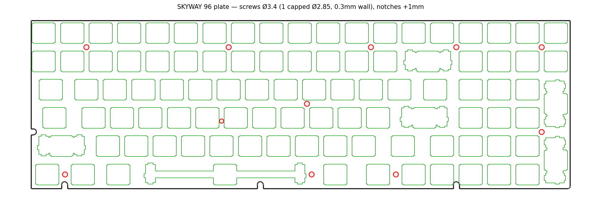

# Switch Plate

Switch/stabilizer mounting plate for the SKYWAY 96 PCB.



| | |
|---|---|
| Size | 361.95 × 114.30 mm |
| Switch cutouts | 99 (Cherry MX, 14 mm) incl. combo cutouts (space, enter, backspace, numpad enter/plus) |
| Screw holes | 11 × **Ø3.4** (M2 + max wiggle); 1 capped to Ø2.85 (PCB-constrained), aligned to PCB mounting holes |
| Edge notches | 4 (bottom + left + right), **grown +1 mm** for clearance |
| Format | `skyway96_plate.dxf` — layered (outline / switch / stab / screw) |

Cut from 1.5 mm FR4, brass, aluminium, or POM (laser / waterjet). The DXF is
SendCutSend-ready (no zero-length segments).

**Changes from PCB-exact:** screw holes opened Ø2.4→**Ø3.4** and notches grown
+1 mm for generous install wiggle; the bottom row left of the arrows is **2 wide
keys (1.5u each — RCtrl + Fn)** instead of three 1u, matching the PCB's two
switches there. Holes are sized **per-hole**: as big as Ø3.4 while keeping a
≥0.3 mm wall to the nearest switch cutout — one PCB-constrained hole is therefore
capped at Ø2.85 (Ø3.4 is the ceiling — M2 heads ~3.8 mm would pull through a bigger hole). Regenerate via `scripts/postprocess_plate.py --screw-dia ... --min-wall ...`.

## Source

Generated from the KLE layout + `KiCAD Source Files/*.kicad_pcb` by
[**KB_PLATE_VALIDATOR**](https://github.com/RivasMario/KB_PLATE_VALIDATOR),
which auto-registers the plate to the PCB and validates that every M2 screw
clears all switch/stab cutouts. Regenerate:

```bash
python scripts/build_plate.py \
  --kle skyway96_kle.json \
  --pcb "../skyway-96/KiCAD Source Files/rivasmario 96% Hotswap Rp2040.kicad_pcb" \
  --out output/skyway96_plate.dxf --pad 0 --snap-screws
```
