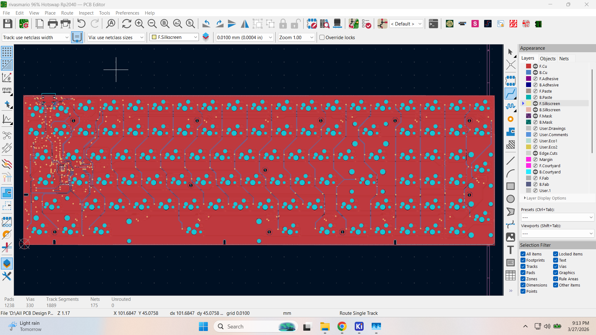

# SKYWAY 96 — Hotswap Keyboard PCB

96% layout, RP2040 MCU, Kailh hotswap sockets, underglow RGB. Designed for JLCPCB assembly.


---

## Specs

| | |
|---|---|
| MCU | RP2040 (QFN-56) |
| Flash | W25Q128JVS (128Mb, SOIC-8) |
| Layout | 96% — 99 keys |
| Switches | Kailh hotswap (MX compatible) |
| RGB | 18x WS2812B underglow |
| USB | USB-C (HRO TYPE-C-31-M-12) |
| Regulator | AMS1117-3.3 |
| ESD | PRTR5V0U2X |
| Firmware | QMK + VIA |

---

## PCB




---

## 3D Renders


---

## 2D Layout


---

## KLE Data


---

## Files

| Folder | Contents |
|---|---|
| `KiCAD Source Files/` | KiCAD project, schematics |
| `Manufacturing & Assembly Files/` | BOM, CPL, Gerbers |
| `QMK Firmware/` | QMK source + VIA json |
| `Schematic/` | Schematic PDF |
| `3D Step File/` | STEP files |
| `VIA Json/` | VIA config |

---

## Firmware Setup & Flashing

### 1. Environment Setup
To compile the firmware, you'll need the [QMK CLI](https://docs.qmk.fm/newbs_getting_started) and the `arm-none-eabi` toolchain. On Fedora, you can install the dependencies with:
```bash
sudo dnf install -y arm-none-eabi-gcc-cs-c++ arm-none-eabi-newlib arm-none-eabi-binutils
```

### 2. Linking the Firmware
Link the keyboard source to your `qmk_firmware` repository:
```bash
ln -sf "$(pwd)/qmk_src" ~/qmk_firmware/keyboards/skyway96
```

### 3. Compiling
Compile the default VIA keymap:
```bash
qmk compile -kb skyway96 -km via
```
This will generate a `skyway96_via.uf2` file in your `qmk_firmware` directory.

### 4. Flashing
1. Put the board in bootloader mode: Hold the **BOOT** button, tap the **RESET** button, then release **BOOT**.
2. The board will appear as a USB drive named `RPI-RP2`.
3. Drag and drop the `skyway96_via.uf2` file into the `RPI-RP2` drive, or run:
```bash
qmk flash -kb skyway96 -km via
```

---

PCB designed by Ahsan Mehmood Awan — `engrahsanmehmoodawan@gmail.com`
